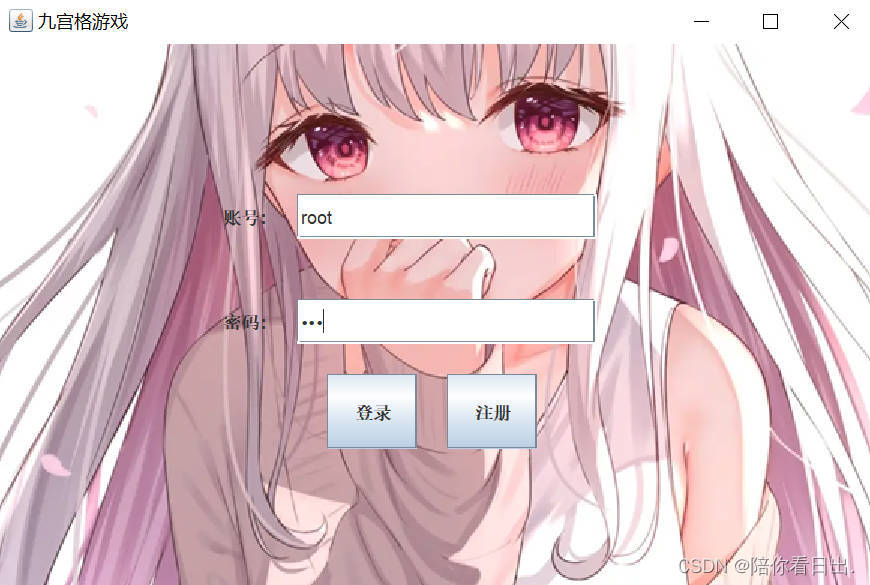
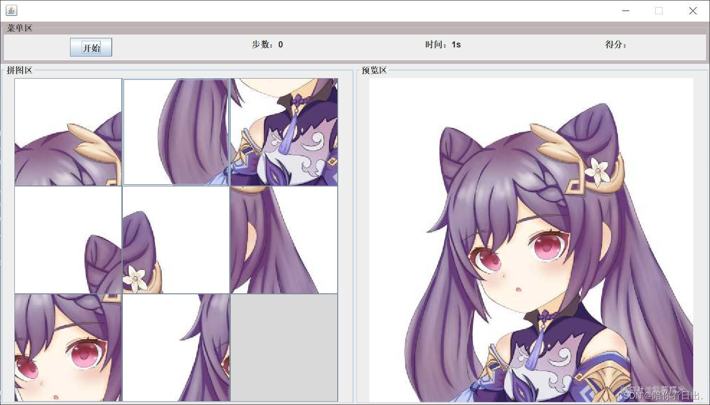

# puzzle_game
Nine-square grid puzzle（九宫格拼图游戏）

## 1 问题描述

拼图游戏不仅能增强思维能力，提高智力而且富含哲理，有助于修身养性。它既有简单易学的特点，为人民群众喜闻乐见。

设计一款拼图游戏，本游戏主要完成：整幅图的现实，切换整幅图片、随机打乱图片、开始游戏，结束游戏 ；可多用户。

### 1.1 数据需求

游戏包括界面，基本的控件，有文本框、选择框、按钮等。

用户信息：用户登录需要的账号和密码，新用户注册用到的信息；对玩家信息的记录、保存、读取。

界面信息：图片，九宫格规格；

交互信息：控制游戏的移动；

### 1.2 功能

#### 游戏界面设计：

用户登录，进入游戏界面，有良好的功能可视化界面，有游戏规则介绍。例如有计时和分数的显示，游戏图片替换和打乱图片的按键，显示游戏界面的图像画面，游戏玩家开始游戏、悔一步，重新开始的按键。

#### 原始图像的选择：

游戏开始时，从准备好的图片中，选择想要拼的图片，要有不同难度的图片（可从相似度考虑）：可选择重新开始；

#### 随机打乱图像：

选择难度（1，2，3），根据难度将图片分成 3*3, 5*5，6*6 的规格，设计算法，随机打乱生成肯定有成功结果的初始化状态九宫格，要求有动态的打乱图片的显示过程（若产生的初始化九宫格无法到达最终状态，应该有提示 3 秒后自动刷新，重新生成）；

####  计时器的设计：

动态显示玩家本局的时间，可选择限时挑战。

####  移动：

用户可以拖动模块进行交换，直到拼出原图像。

1）通过鼠标点击进行移动操作，动态的展示每一步移动的结果。如果操 作违法，应不做该操作；

2）能够刷新界面；

3）游戏过程中，允许选择悔一步（不可后退多步，若用户悔步>1，给出提示且不执行多次后退操作）或者终止游戏（正常），继续下一步；

#### 结束游戏：

系统能自动检查到用户拼合出原图。 若成功结束游戏，总分=时间分数+移动正确率（正确数/移动正确率）*100，将本场的游戏时间加入到游戏记录中，并按照排序显示之前游戏的时间和该用户信息。上传分数以及获取排名，可以选择删除之前的成功记录，但是不可以用户随意增加记录。

## 2 程序实现

### 2.1界面设计

界面要包括登录界面，注册界面，游戏模式选择界面和游戏界面

### 2.2图像分割

借助java种的集合ArrayList类进行随机打乱，对于八数码问题还需要考虑序列的逆序数的奇偶性问题

### 2.3图像移动

实现图像移动借助了按钮之间的组件交换

### 2.4判断胜利

通过每次移动后比较各个组件的位置来判断游戏是否胜利。

## 3界面截图

